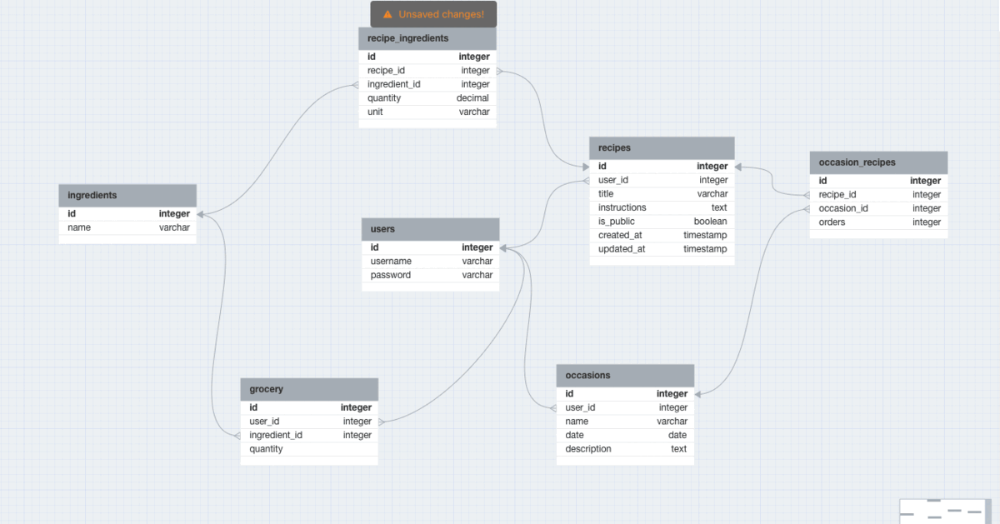

# Brainstorming

1. Users
2. Recipes
3. Ingredients
4. username
5. password
6. email
7. occasions
8. grocery lists

# Table Ideas

## Users

- stores the users info username, password, email

## Recipes

- title, instructions, public/private

## Ingredients

- name and other ingredient related info

## Grocerys List

- quantity and other grocery related info

## Occasions

- info if the occasion is public or private and name

## Occasions_Recipes

- id, recipe_id

## Recipe_ingredients

- quantity, id, recipe_id, ingredient_id

# Relationships

1. one-to-one
2. one-to-many

   - many recipes can belong to one user
   - many recipe_ingredients can belong to one recipe
   - many recipe can use the same ingredient
   - many grocery lists can belong to one user
   - many grocery lists can include the same ingredient
   - many occasions can belong to one user
   - many recipes can be associated with one occasion
   - many occasions can include the same recipe

3. many-to-many

   - many ingredients can be used in many recipes

   

CREATE TABLE users (id SERIAL PRIMARY KEY, username VARHCAR(50) UNIQUE, password VARCHAR(255));

CREATE TABLE recipes (id SERIAL PRIMARY KEY, user_id INT, title VARCHAR(255), instructions TEXT, isPublic BOOLEAN, created_at TIMESTAMP DEFAULT CURRENT_TIMESTAMP, updated_at DEFAULT CURRENT_TIMESTAMP ON UPDATE CURRENT_TIMESTAMP);

CREATE TABLE ingredients (id SERIAL PRIMARY KEY, name VARCHAR(255) UNIQUE);

CREATE TABLE recipe_ingredients (id SERIAL PRIMARY KEY, recipe_id INT, ingredient_id INT, quantity DECIMAL(10, 2), unit VARCHAR(50), FOREIGN KEY (recipe_id) REFERENCES Recipes(id),
FOREIGN KEY (ingredient_id) REFERENCES ingredients(id));

CREATE TABLE grocery (id SERIAL PRIMARY KEY, user_id INT, ingredient_id INT, quantity DECIMAL(10, 2), CHECK (Quantity >= 0),
FOREIGN KEY (user_id) REFERENCES users(id),
FOREIGN KEY (ingredient_id) REFERENCES ingredients(id));

CREATE TABLE occasions (id SERIAL PRIMARY KEY, user_id INT, name VARCHAR(255), date DATE, description TEXT, FOREIGN KEY (user_id) REFERENCES Users(id));

CREATE TABLE occasion_recipes (id SERIAL PRIMARY KEY, occasion_id INT, recipe_id INT, order INT, FOREIGN KEY (occasion_id) REFERENCES occasions(id), FOREIGN KEY (recipe_id) REFERENCES recipes(id));
